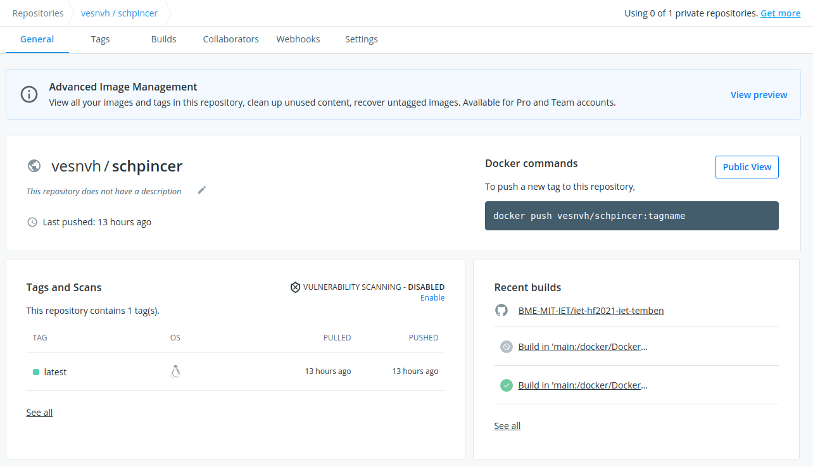
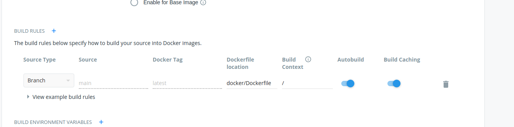
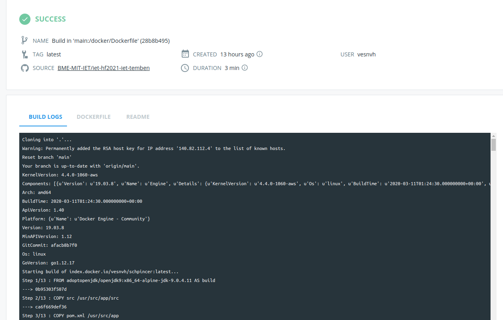

# Docker automatikus image készítés beállítása

## Docker image-k
Konténerizálni az alkalmazásunkat és ezáltal minél könnyebben használhatóvá, futtathatóvá tenni 
jó dolog. Szerintem. Ebben segít a docker, és ezen belül is az Image-k amiknek pontosan megadjuk, hogy
hogyan épül fel az adott futtatni kívánt projekt és az azt felhasználó másik fejleszőnek elég indítani
egy konténert az adott kép alapján, esetleg még környezeti változókat átadni további konfiguráció érdekében.

## Automatikus image készítés beállítása
A docker image-ket tudjuk lokálisan tárolni, ha csak saját gépünkön szeretnénk őket használni, azonban
lehet egy felhőben is ahonnan bárki elérheti, és így mások is tudják használni. Egy ilyen felhő alapú
tárolási lehetőség a Docker Hub (https://hub.docker.com/). Itt létrehozhatunk repositorykat amikben
tároljuk az image-ket. Létrehoztam a projektnek egyet a saját Docker Hub felhasználóm alatt. \
https://hub.docker.com/repository/docker/vesnvh/schpincer  
Itt elég sok információt kapunk a projektről:
- név
- leírás
- utolsó build
- elkészült tagelt image-k
- a github projekt ReadMe-je  

  
Az automatikus build beállítását el tudjuk végezni Github action-ök használatával is, azonban én 
a Docker Hub funkcióját használtam erre. A __Builds__ menüpont alatt tudjuk konfigurálni az automatikus buildeket.
Itt én azt választottam hogy a _main_ branche beérkező módosításkor automatikusan készüljön egy image.

Amint a build lefutott láthatjuk, a logokat illetve hogy sikeres volt-e a build.

## Tanulságok
Docker Hub integráció segítségével egészen egyszerűen tudunk automatikusan Docker Image-eket készíteni, azonban
ha valami extra dolgot szeretnék mint például verziózás akkor már érdemesebb lehet __Actions__-t használni.