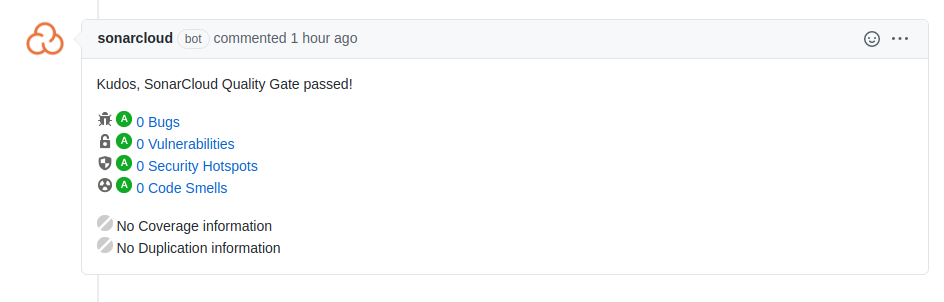
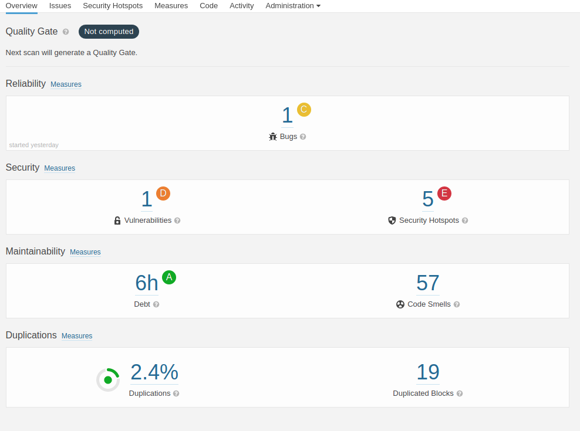

# SonarCloud statikus ellenőrző bevezetése

## Beállítás
A SonarCloud beállítása során egy új workflow fájlt kellett létrehozni amely leírja hogy milyen
lépésekből áll az folyamat. A beállítás során továbbá még meg kellett határozni, hogy milyen események hatására
fusson a folyamat. Itt azt választottam, hogy pull requesteken és a main-re való mergeléskor fusson.
P

Pull requesteknél az alábbi módon néz ki:

Illetve a sonar webes felületén is meg lehet nézni a kód állását:

## Sonar hibák javítása:
A sonár hibák javítása során sok olyan problémát írt ki amiket úgy véltem, hogy inkább csak kikapcsolom 
rá a warningot, hiszen statikus ellenőrző szemmel valóban hiba fejlesztői szemmel viszont tudjuk pontosan,
hogy az adott dolog miért úgy van / miért kell úgy lennie.
Ezeket a warningokat az alábbi annótációval tudjuk kikapcsolni: `@SuppressWarnings("warningCode")`
Ezt követően a sonar ignorálni fogja az adott metódusban / osztályban az adott issue-t.

## Tanulságok
Amit szerintem érdemes megjegyezni a sonar-ról (és valószínűleg a többi statikus ellenőrzőről is),
hogy nem emberek. Természetesen ők nagyon tudják, hogy mit kéne csinálni, hogy javuljon a kódminőség,
vagy hogy megfeleljünk az osszes szabványnak, de való életben még mindig a fejlesztő tudja meghozni a döntést,
hogy meg lehet-e egyáltalán csinálni a változtatást amit a sonar javasol, vagy hogy éppen van-e jogosultsága.